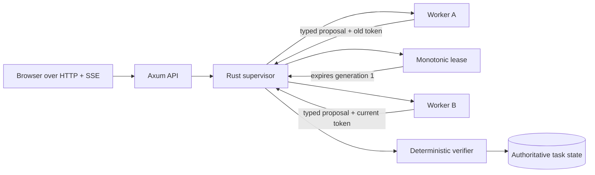

# Meld

Meld is a Rust-native reliability layer for AI work. It gives each worker an expiring assignment, reassigns work when that lease expires or a worker fails, verifies proposed output with deterministic policy, and rejects late results that no longer have authority.

The current demo analyzes a fixed checkout incident. Worker A does the work but deliberately withholds its result past its lease. Meld issues generation 2 to Worker B, verifies Worker B's structured answer, completes the mission, and later rejects Worker A's generation-1 result without changing the accepted outcome.

## How it fits together



Workers are untrusted proposal producers. Only the supervisor can mutate lifecycle state, and only the deterministic verifier can authorize completion. The browser is a projection of backend snapshots and sequenced events; it never advances the lifecycle itself.

## Execution modes

`deterministic` is the default. It needs no account, network, or secret and exercises the complete lease, reassignment, verification, completion, and stale-result path.

`rig` enables two real Gemini-backed workers through Rig. Each model response is extracted into a typed incident proposal, then checked by the same Rust verifier used in deterministic mode. The default model is `gemini-3.6-flash`. A provider failure, malformed structured response, or request timeout becomes a normal worker failure; it never bypasses the supervisor.

The Cargo feature and runtime mode are separate controls:

- `--features rig-worker` compiles the reviewed Rig/Gemini dependency graph.
- `MELD_EXECUTION_MODE=rig` selects it at runtime.
- Omitting either leaves the known-good deterministic path available.

## Run locally

Requirements: the Rust toolchain pinned in `rust-toolchain.toml` and Cargo. No Node process is needed because Axum embeds and serves the existing frontend.

Deterministic mode:

```bash
cargo run --locked
```

Open <http://127.0.0.1:3000> and choose **Run recovery mission**.

Real-agent mode:

```bash
cp .env.example .env.local
# Put a scoped Gemini API key in .env.local, then:
set -a
source .env.local
set +a
cargo run --locked --features rig-worker
```

`.env.local` is ignored by Git. Do not paste credentials into chat, commit them, place them in browser assets, or enable shell tracing while sourcing the file. Use a scoped, low-value project key and rotate it after a public demo.

Rig mode sends the fixed incident mission records to the configured Gemini model. Use deterministic mode when external transmission is not intended. The current fixture is synthetic, but future user-authored missions will need an explicit data-handling policy before live-provider use.

## Configuration

| Variable | Default | Meaning |
| --- | --- | --- |
| `MELD_EXECUTION_MODE` | `deterministic` | `deterministic` or `rig` |
| `GEMINI_API_KEY` | none | Required only in `rig` mode |
| `MELD_GEMINI_MODEL` | `gemini-3.6-flash` | Gemini model used by both Rig workers |
| `MELD_ASSIGNMENT_LEASE_MS` | `35000` | Generation-1 lease in real-agent mode |
| `MELD_PROVIDER_TIMEOUT_MS` | `25000` | Maximum duration of one provider request |
| `MELD_AGENT_A_DELAY_MS` | `65000` | Delay applied after Worker A produces its result |
| `MELD_BIND` | `127.0.0.1:3000` | HTTP bind address |

Meld refuses unsafe timing combinations: provider timeout must be shorter than the lease, and Worker A's delay must exceed the lease plus one provider timeout. This makes Worker B able to finish before Worker A's stale return.

## Verify the project

```bash
cargo fmt --all -- --check
cargo clippy --workspace --all-targets --all-features --locked -- -D warnings
cargo test --locked
cargo test --features rig-worker --locked
```

The feature-enabled tests use a narrow mocked analyzer boundary, so they need no provider account or network. They cover valid structured output, malformed output, provider failure, provider timeout, delayed execution, normal recovery, deterministic acceptance, and generation-1 stale rejection.

## Run Meld as a real developer workflow

The repository includes a manually dispatched GitHub Actions recovery gate. It checks out an exact revision, builds Meld with the pinned Rust toolchain, starts the real Axum server, invokes the mission through HTTP, and fails unless the backend proves all of these outcomes:

- Worker A's generation-1 lease expires;
- Worker B's generation 2 passes deterministic verification and completes;
- Worker A's late generation-1 submission is rejected;
- the accepted result still belongs to Worker B.

In GitHub, open **Actions → Meld recovery gate → Run workflow** and select `deterministic`. The run publishes the complete backend-authored lifecycle in its job summary. This is Meld operating inside an actual remote CI workflow, not a browser animation or a unit-test-only simulation.

The optional `rig` choice additionally needs a `GEMINI_API_KEY` repository secret with available quota. The secret is exposed only to the server-start step when Rig mode is explicitly selected. Do not add a key merely to run the deterministic proof.

The same gate can be rehearsed locally while Meld is running:

```bash
bash scripts/verify-recovery.sh
```

## Live Gemini proof

The final credentialed run on 2026-08-26 completed the full recovery in approximately 77.6 seconds. Worker A produced a real parsed Gemini result in 12.562 seconds, before its 35-second lease expired. Worker B then produced a separate real result in 6.252 seconds; Rust verified and accepted generation 2. After the 65-second controlled post-result delay, Worker A's genuine generation-1 output arrived and was rejected stale. Generation 2 remained authoritative.

Snapshots and SSE now include additive `agent.execution.started`, `agent.output.parsed`, and `agent.execution.failed` events. Safe metadata includes provider, model, duration, assignment identity, and structured candidate fields. Completed snapshots expose the accepted incident analysis and the deterministic checks that passed. Existing endpoint paths and fields are unchanged, and the browser's event ledger renders the new backend messages without frontend timers.

## API compatibility

Phase 3 keeps the Phase 2 browser contract intact:

- `GET /api/health`
- `POST /api/missions/demo`
- `GET /api/tasks/{task_id}`
- `GET /api/tasks/{task_id}/events`

The frontend files are unchanged in Phase 3. Deterministic and real-agent modes both enter the same supervisor and emit the same lifecycle event shapes.

## Security and current limits

All direct dependency versions are exact and `Cargo.lock` is committed. The Rig integration is optional, uses one provider, disables broad defaults, uses Rustls with an explicit Ring provider, and logs identifiers/provider/model rather than secrets, prompts, or full outputs. Runtime tracing is filtered to Meld-owned targets so a dependency cannot print an unredacted provider response into ordinary server logs. See [Supply-chain security](docs/SUPPLY_CHAIN_SECURITY.md) for the complete dependency and workflow review.

This is an in-memory, single-process MVP. Restarting loses task state. Assignment tokens are not yet remote-worker credentials. There is no multi-node leader election, durable event log, arbitrary user-authored mission schema, broad agent tool access, or model-as-judge authority.

Engineering details are recorded in [Architecture](docs/ARCHITECTURE.md), [Decisions](docs/DECISIONS.md), [Build log](docs/BUILD_LOG.md), and [Learning Rust through Meld](docs/RUST_LEARNING.md).
