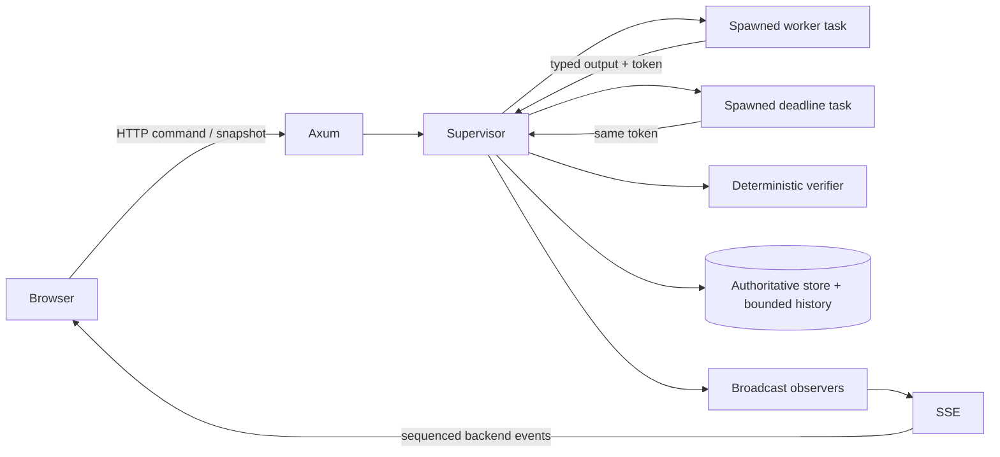
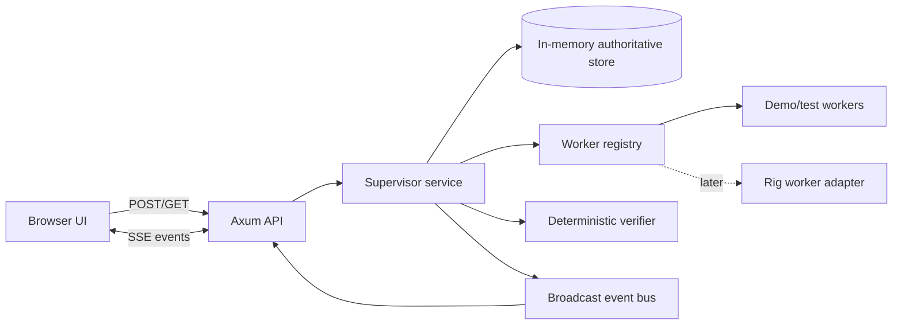
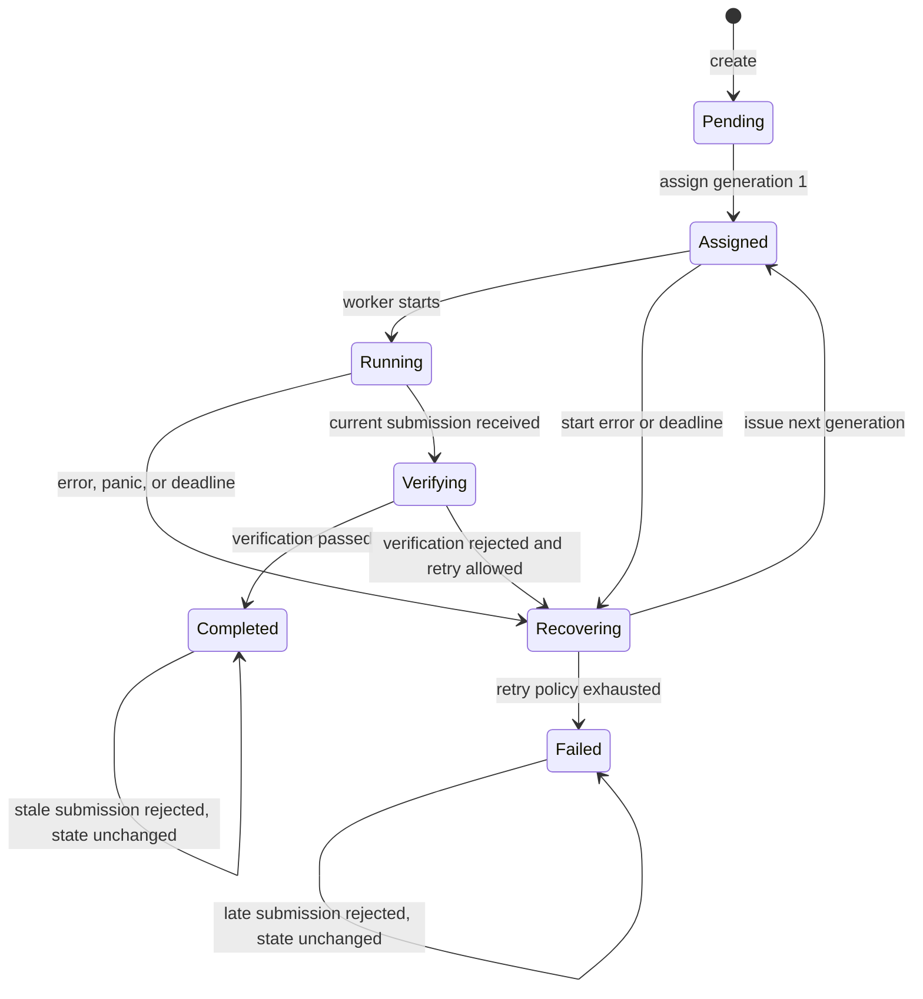
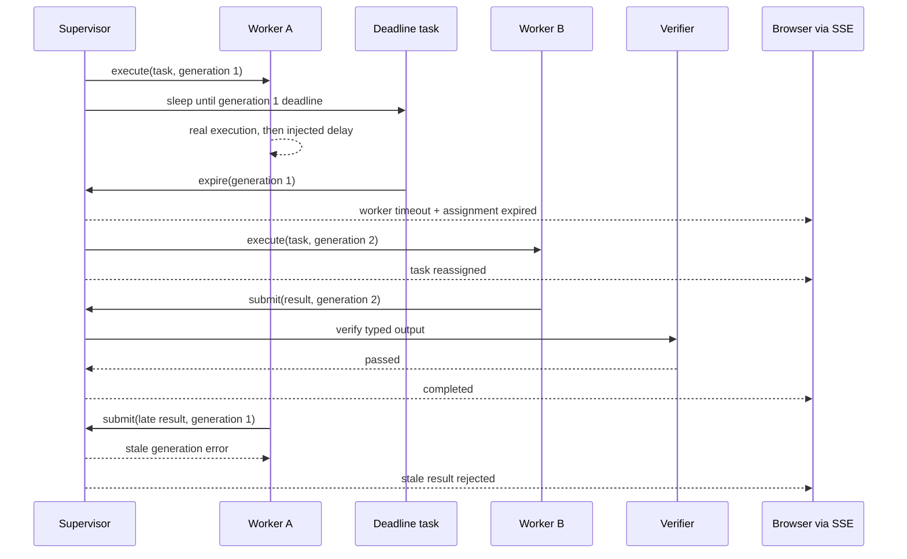

# Meld Architecture

## Product boundary

Meld keeps work running when an agent fails and verifies the work before accepting it. The key boundary is simple:

- workers propose outputs;
- deterministic Rust code owns task truth.

A worker cannot set a task to `Completed`. It can only submit a typed candidate result together with the assignment token it was given. The supervisor decides whether that token is current, whether the transition is allowed, and whether verification passes.

## Phase 2 implementation status

The deterministic kernel remains unchanged and tested. `src/domain.rs` contains the types and `TaskState`; `src/supervisor.rs` remains the only state mutation boundary; `src/worker.rs` contains the object-safe worker trait and composable deterministic workers; `src/verifier.rs` contains the deterministic verifier; and `src/events.rs` contains immutable sequenced events. Phase 2 adds only a transport and presentation boundary: `src/api.rs`, the Axum binary in `src/main.rs`, and locally embedded assets under `static/`. Rig remains intentionally absent.

The implemented runtime path is:



The worker and deadline race is intentional. Both call supervisor methods which compare the assignment token while holding the authoritative store lock, so only one can make the decisive transition.

## Smallest architecture for the MVP

Meld will initially be a single process and a single deployable binary.



This is deliberately not a distributed system. One process means one authority and avoids consensus, external queues, Redis, and deployment complexity during the MVP. The core domain methods will not depend on Axum, so persistence or another transport can be added later.

## Major components

### Domain

The domain module defines typed identifiers, task states, assignments, submissions, failures, and events. It contains no Axum or Rig types.

Implemented newtypes:

```rust
struct TaskId(u64);
struct AssignmentId(u64);
struct SubmissionId(u64);
struct Generation(u32);
struct WorkerId(String);
```

Using separate types prevents accidentally comparing or passing two unrelated integers.

Implemented core records:

```rust
struct Mission {
    title: String,
    objective: String,
    acceptance: AcceptanceCriteria,
}

struct Assignment {
    id: AssignmentId,
    task_id: TaskId,
    worker_id: WorkerId,
    generation: Generation,
    issued_at: Instant,
    deadline: Instant,
}

struct AssignmentToken {
    task_id: TaskId,
    assignment_id: AssignmentId,
    generation: Generation,
}

struct Submission {
    id: SubmissionId,
    token: AssignmentToken,
    output: WorkerOutput,
}
```

`WorkerOutput` and `AcceptanceCriteria` are typed for a small fixture mission rather than unstructured arbitrary JSON. A later generic API can use an explicitly versioned schema.

### State machine

The authoritative state is an enum, not a set of loosely related booleans or strings:

```rust
enum TaskState {
    Pending,
    Assigned { assignment: Assignment },
    Running { assignment: Assignment, started_at: Instant },
    Recovering {
        expired: Assignment,
        reason: FailureReason,
        next_generation: Generation,
    },
    Verifying { assignment: Assignment, submission: Submission },
    Completed { accepted: VerifiedOutput, completed_at: SystemTime },
    Failed { reason: TerminalFailure, failed_at: SystemTime },
}
```

`Recovering` is a real state so the UI can show that Meld detected and handled the problem. `Failed` is terminal and used only when the retry policy is exhausted or the mission cannot be verified. An individual worker failure does not imply a terminal task failure.

Allowed transitions:



Submission rejection is not a state transition. It produces an audit event and returns a typed error.

Important typed reasons include:

```rust
enum FailureReason {
    WorkerError { code: WorkerErrorCode },
    DeadlineExceeded,
    WorkerPanicked,
    VerificationRejected { code: VerificationCode },
}

enum SubmissionRejection {
    UnknownTask,
    UnknownAssignment,
    StaleGeneration { submitted: Generation, current: Generation },
    WrongAssignment,
    TaskAlreadyTerminal,
    InvalidPayload,
}
```

### Supervisor

The supervisor is the only component that changes authoritative state. Its public methods correspond to domain commands such as:

- `create_task`
- `assign_next_worker`
- `mark_worker_started`
- `expire_assignment`
- `record_worker_failure`
- `submit_result`
- `record_verification`

Each method:

1. locks the store;
2. checks the current state and assignment token;
3. applies exactly one allowed transition;
4. appends one or more domain events;
5. releases the lock;
6. publishes cloned events to observers.

No network call, worker execution, verification that can block, or sleep occurs while the mutex is held.

### Shared state

The Axum handlers, worker tasks, and deadline tasks share an `Arc<AppState>`. The authoritative store is protected by `tokio::sync::Mutex`.

The mutex is chosen over `RwLock` for the MVP because most interesting operations validate and mutate state atomically, the data set is tiny, and SSE readers consume published events rather than repeatedly holding read locks. This favors correctness and explainability over theoretical read concurrency.

### Worker abstraction

The reliability layer does not know about Rig:

```rust
type WorkerFuture =
    Pin<Box<dyn Future<Output = Result<WorkerOutput, WorkerError>> + Send + 'static>>;

trait Worker: Send + Sync {
    fn id(&self) -> WorkerId;
    fn execute(&self, request: WorkRequest) -> WorkerFuture;
}
```

Returning a boxed standard-library `Future` keeps heterogeneous workers possible without adding the `async-trait` proc macro dependency. If this signature proves too distracting for learners, adding `async-trait` can be reconsidered through the dependency review process.

Implemented workers:

- `SuccessfulWorker`;
- `ErrorWorker`;
- `PanicWorker` for Tokio join-error handling;
- generic `ControlledDelayWorker<W>`, which can wrap any current or future worker;
- later, a `RigWorker` adapter behind a Cargo feature.

The demo fault is a real late return. Worker A runs in its own Tokio task and returns after generation 1 has expired. Meld does not cancel that task immediately, which allows the stale-submission defense to be visibly exercised. Production policy can add a cancellation grace period later.

### Verifier abstraction

Verification is separate from worker execution:

```rust
trait Verifier: Send + Sync {
    fn verify(
        &self,
        mission: &Mission,
        output: WorkerOutput,
    ) -> Result<VerifiedOutput, VerificationError>;
}
```

For the MVP, verification is deterministic and synchronous: schema validation, required fields, length/range constraints, and mission-specific acceptance rules. It must not be a second LLM merely saying the first LLM looks correct. If semantic model-based evaluation is added later, it is advisory unless a deterministic policy decides how its typed result affects state.

### Event model

Events are immutable facts created by the backend:

```rust
struct MeldEvent {
    sequence: u64,
    task_id: TaskId,
    occurred_at: SystemTime,
    kind: EventKind,
}

enum EventKind {
    TaskCreated,
    TaskAssigned { worker_id: WorkerId, generation: Generation },
    WorkerStarted { worker_id: WorkerId, generation: Generation },
    WorkerFailed { worker_id: WorkerId, reason: FailureReason },
    AssignmentExpired { generation: Generation },
    TaskReassigned { from: WorkerId, to: WorkerId, generation: Generation },
    SubmissionReceived { worker_id: WorkerId, generation: Generation },
    StaleSubmissionRejected { worker_id: WorkerId, submitted: Generation, current: Generation },
    VerificationStarted,
    VerificationFailed { code: VerificationCode },
    VerificationPassed,
    TaskCompleted,
}
```

The per-process monotonically increasing `sequence` lets the browser order events deterministically. The current task snapshot remains authoritative; the broadcast stream is a delivery mechanism, not the source of truth.

Structured `tracing` records mirror significant domain events but omit prompts, credentials, and full model outputs.

## Real failure detection and recovery

The MVP uses assignment deadlines rather than heartbeats. This is sufficient to prove a real unresponsive/late worker and is smaller than a heartbeat protocol.



When an assignment is issued, Meld spawns:

- the worker task; and
- a deadline task that sleeps until the lease deadline and then calls `expire_assignment(token)`.

`run_task` uses `tokio::select!` to observe both handles, but it does not cancel the losing operation. If the result wins, the deadline task remains detached and later performs a harmless current-token check. If the deadline wins, the worker remains detached and its eventual output still enters `submit_result`, where it is rejected if stale.

Both paths may race. The supervisor's atomic token check under the mutex resolves the race:

- if the current worker submitted first, the deadline becomes a harmless no-op;
- if the deadline expired first, the late worker submission is rejected.

This is real detection based on server time. No browser timer can expire an assignment.

The initial MVP does not implement heartbeats. Heartbeats are useful for long-running work and earlier failure detection, but they create protocol and liveness complexity that is unnecessary for a short, bounded demo mission.

## Assignment generations and stale-result protection

Each task has a monotonically increasing generation. Reassignment creates a fresh `AssignmentId` and increments `Generation`. The active state contains the one currently valid assignment.

A submission is eligible for verification only when all of these match:

- task ID;
- assignment ID;
- generation;
- active non-terminal task state.

Generation comparison is performed before output verification. Therefore a stale worker cannot spend verifier resources or overwrite an accepted result. A late generation-1 result remains generation 1 forever; Worker B's generation 2 does not transfer authority back to Worker A.

Assignment tokens are capabilities but not secrets in the single-process MVP. If remote untrusted workers are added, tokens must become unguessable, authenticated, scoped, and transported over TLS. Generation checks still remain necessary even with authentication.

## Where Tokio is required

Tokio provides:

- the Axum server runtime;
- concurrent worker tasks through `tokio::spawn`;
- lease deadlines through `tokio::time::sleep_until`;
- bounded execution coordination without blocking threads;
- the async mutex around the in-memory store;
- the broadcast channel used by SSE observers;
- graceful shutdown handling.

Tokio does not own the state machine. Domain transition methods remain normal deterministic Rust that can be tested with controlled time and fake workers.

## Do we need channels?

Only one channel is needed initially: `tokio::sync::broadcast` for domain-event observers.

We do not need an actor-style command channel for state mutation in the MVP. Direct supervisor method calls plus a mutex are easier to understand and test. Adding a command actor would introduce request/response channels, lifecycle management, and backpressure policy before the workload requires them.

The broadcast channel is not reliable storage. A lagging SSE client may miss messages, so reconnect behavior is:

1. fetch the current task snapshot and stored event history;
2. subscribe to new events;
3. deduplicate/order by sequence number.

The in-memory event history is bounded per task to prevent unlimited growth.

## Where Rig belongs

Rig belongs in `workers/rig.rs` as one implementation of `Worker`. It translates a typed `WorkRequest` into a single provider call and translates the response back into `WorkerOutput`.

Rig must not:

- own task state;
- choose assignment generations;
- decide that verification passed;
- directly publish authoritative events;
- receive store or supervisor mutation authority.

The first implementation phases use deterministic fake workers. Rig is added only after the recovery tests pass and after its feature graph, build scripts, proc macros, native dependencies, and transitive source changes are reviewed. It should be feature-gated so the core can build and test without model-provider dependencies.

## Implemented backend API

The API is deliberately small:

| Method | Path | Purpose |
| --- | --- | --- |
| `GET` | `/api/health` | Process readiness and version; no secrets |
| `POST` | `/api/missions/demo` | Create and start the known demo mission through normal supervisor logic |
| `GET` | `/api/tasks/{task_id}` | Current authoritative snapshot plus accepted result if completed |
| `GET` | `/api/tasks/{task_id}/events` | SSE stream of backend events, with sequence IDs |

Worker submission is initially an internal supervisor method because workers run in-process. A remote `POST /api/tasks/{id}/submissions` endpoint is postponed until authentication and unguessable assignment credentials exist.

`POST /api/missions/demo` selects the fault-injection policy, but it does not select outcomes or directly manipulate state. It constructs normal worker adapters and starts the same supervisor path used by any mission.

## Frontend/backend communication

The page loads an authoritative snapshot over HTTP, merges its stored event history, opens one SSE connection, and reduces events in sequence order. The SSE handler subscribes to broadcast before reading history, then removes duplicates by sequence. Browser reconnection sends the last SSE ID in `Last-Event-ID`, and the server replays only later history. If the broadcast receiver reports lag, the server emits a non-domain `resync` delivery event; the browser refetches the snapshot/history. The connection can never delay worker execution or change task state.

SSE is preferred to WebSockets because communication is one-way after the run starts, browser support is native, reconnection semantics are simple, and the API does not need a bidirectional socket protocol. Polling would work but would make the two-minute story feel less immediate and introduce avoidable latency.

The frontend never generates domain events. It may animate the arrival of a backend event, but it cannot change the event order, manufacture success, or advance a task on a local timeout.

## UX and demo flow

The UI is one focused execution surface for Meld users and agent builders rather than a dashboard. The visual hierarchy is:

1. Product promise: **Agent work, kept authoritative.**
2. One clear action: **Run recovery mission**.
3. Mission status: running, recovering, verifying, or completed.
4. A horizontal/stacked execution path: Worker A → Meld recovery → Worker B → Verifier.
5. A human-readable event story, with technical IDs available in a secondary detail view.
6. Final proof: mission completed, one failure recovered, generation 2 accepted, generation 1 rejected.

The tone is technical and assured, not a generic analytics dashboard. Status must use icon, label, and color together so it is not color-dependent. Motion should be short and functional, respect `prefers-reduced-motion`, and only acknowledge backend events.

The backend-controlled run is intentionally short enough to understand in one sitting:

- **0:00–0:15:** State the promise and press Run.
- **0:15–0:35:** Worker A visibly starts real work; its lease and generation are shown.
- **0:35–0:55:** The backend deadline expires; Meld marks the assignment invalid and explains why.
- **0:55–1:20:** Worker B runs under generation 2 and submits output.
- **1:20–1:40:** Deterministic verification passes and the result becomes authoritative.
- **1:40–1:55:** Worker A returns late; Meld rejects generation 1 without changing completion.
- **1:55–2:00:** Final proof summary remains on screen.

Production defaults use a 2.4-second generation-1 lease, a 4.8-second controlled late return, and a 650-millisecond generation-2 controlled execution. These durations are configured in Rust. Browser code has no lifecycle timeout.

### Frontend choice

The implementation uses semantic HTML, CSS custom properties, and browser-native JavaScript embedded into the Rust binary with `include_str!`. It has a Map/Diagram composition, an accessible command palette, keyboard focus states, 320–768 px responsive layouts, and `prefers-reduced-motion` handling. No frontend package manager, CDN, runtime font request, or separate static server is needed.

## Repository structure after Phase 2

```text
Meld/
├── Cargo.toml
├── Cargo.lock
├── rust-toolchain.toml
├── src/
│   ├── lib.rs
│   ├── main.rs
│   ├── api.rs
│   ├── domain.rs
│   ├── events.rs
│   ├── supervisor.rs
│   ├── verifier.rs
│   └── worker.rs
├── tests/
│   ├── api.rs
│   └── lifecycle.rs
├── static/
│   ├── index.html
│   ├── styles.css
│   └── app.js
├── tokens.css
└── docs/
    ├── ARCHITECTURE.md
    ├── BUILD_LOG.md
    ├── DECISIONS.md
    ├── RUST_LEARNING.md
    └── SUPPLY_CHAIN_SECURITY.md
```

A single crate remains enough. State transitions remain in `supervisor.rs`; `api.rs` maps domain snapshots and events into safe serialized response types without adding Serde derives to the domain.

## Prioritized three-day plan

### Day 1 — prove reliability without HTTP or an LLM

Status: complete on 2026-08-24.

1. Repair/initialize Git metadata and pin the Rust toolchain.
2. Scaffold one binary crate with the minimum reviewed dependencies.
3. Implement domain types and the explicit state machine.
4. Implement supervisor token checks, retry policy, and event history.
5. Implement deterministic workers and verifier.
6. Test success, error, timeout, reassignment, stale return, verification rejection, and verified completion.

Exit criterion: `cargo test --locked` proves the lifecycle with no frontend and no model API.

### Day 2 — expose and visualize the real system

Status: complete in code and automated tests on 2026-08-24; manual browser verification recorded in `BUILD_LOG.md`.

1. Add Axum endpoints and typed error responses.
2. Add SSE with snapshot/reconnect behavior.
3. Build the single-screen frontend and accessibility states.
4. Wire the Run button to the real demo mission.
5. Add structured tracing and redaction checks.
6. Exercise the whole flow from a browser, including a reconnect.

Exit criterion: a browser renders only backend state/events and the stale result is visibly rejected.

### Day 3 — integration, security, and rehearsal

1. Review the Rig dependency delta and add the adapter only if it is stable enough for the demo.
2. Keep a deterministic local worker mode as an offline fallback that exercises identical supervisor logic.
3. Run formatting, lints, tests, advisory/source/license checks, and inspect the final lockfile.
4. Prefetch dependencies and verify the final build with `--locked`; rehearse with network unavailable where possible.
5. Polish copy, timing, focus behavior, mobile layout, reduced motion, error recovery, and the final proof summary.
6. Rehearse the two-minute flow and one-minute answers.

Exit criterion: a reproducible, real recovery demo plus a known-good offline path, with no unresolved critical advisory or unexplained dependency.

## Explicitly postponed

- durable database storage and process-restart recovery;
- multi-node leadership or distributed locks;
- remote worker registration and authentication;
- cryptographically signed assignment capabilities;
- heartbeats and adaptive lease renewal;
- arbitrary user-defined task schemas;
- multiple LLM/model providers;
- model-based semantic judging as an authority;
- a general plugin/tool permission system;
- shell, filesystem, or broad network tools for agents;
- Redis, Kafka, Kubernetes, OpenTelemetry, and Grafana;
- accounts, organizations, billing, and role-based access control;
- long-term event retention, analytics, and replay;
- a frontend framework and Node package graph;
- formal dependency attestation with `cargo-vet` until the dependency set stabilizes.

## Known MVP limitations

State and events are lost on process restart. Only one process may be authoritative. Assignment tokens are not suitable for remote untrusted workers. Server wall-clock timestamps are for display; Tokio monotonic `Instant` values enforce deadlines. These are conscious limits, not hidden guarantees.
